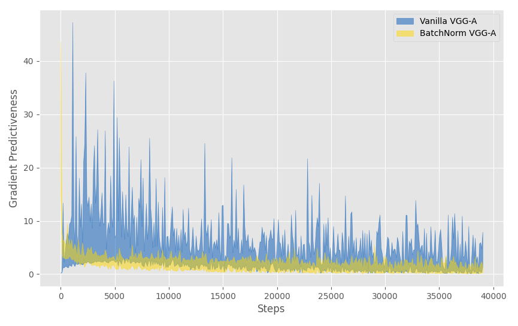

# DessiAdam
An Adam version of DessiLBI optimizer put forward in  paper Yanwei Fu, Chen Liu, Donghao Li, Xinwei Sun, Jinshan Zeng, and Yuan Yao. Dessilbi: Exploring structural sparsity of deep networks via differential inclusion paths. In *International Conference on Machine Learning, pages 3315–3326. PMLR*, 2020.

To plot a loss landscape of VGG-A network (with or without BatchNorm), please run ```VGG_Loss_Landscape.py```. This is a repetition of partial work in  Santurkar, Shibani, Dimitris Tsipras, Andrew Ilyas, and Aleksander Madry. How does batch normalization help optimization? In *Advances in neural information processing systems 31*, 2018.<br>
Examples:<br>




To train a VGG-A network using DessiLBI or DessiAdam, please run ```VGG_trainer.py```. Please edit the optimizer you like to employ before running it.<br>
To train a LeNet-5 network using DessiLBI or DessiAdam, please run ```LeNet_trainer.py```.<br>
If you want to apply DessiAdam to train some other networks, the following codes are needed.

```python
from slbi_adam import SLBI_Adam
import torch
name_list, layer_list = [], []
    for name, p in model.named_parameters():
        name_list.append(name)
        print(name)
        if len(p.data.size()) == 4 or len(p.data.size()) == 2:
            layer_list.append(name)

optimizer = SLBI_Adam(model.parameters(), lr=lr, kappa=1, mu=100)
optimizer.assign_name(name_list)
optimizer.initialize_slbi(layer_list
```

Then you can use it as other built-in optimizers.

```python
optimizer.zero_grad()
loss.backward()
optimizer.step()
```
